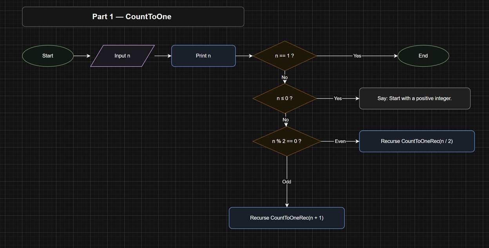

Devin Puckett]

[CST-250 Programming in C#2]

[Grand Canyon University]

[10/27/2025]

[Activity 3]

[https://github.com/devinpuckett4/CST-250-Activity3/blob/main/Activity3.md]

[https://www.loom.com/share/e4cd7b3d2a124f3db913bfd7dd99e478]

 
FLOW CHART

Figure 1a: Flow chart of Count

This flowchart shows how the CountToOne program works. The user enters a number and the program prints each step. If the number is 1, the program ends. If the number is less than or equal to zero, it reminds the user to start with a positive number. If the number is even, it cuts the number in half. If the number is odd, it adds one to make it even. The program keeps repeating these steps until it finally reaches 1.

Figure 1b: Flow chart of Factorial

This flowchart shows both the iterative and recursive ways to calculate a factorial. First, the user enters a number. The program solves it by multiplying from 1 up to that number. It also solves it using recursion, where the function keeps calling itself until it reaches 1. Then the program prints both answers so the user can compare the results.

Figure 1c: Flow chart of GCD

This flowchart explains how the program finds the greatest common divisor of two numbers. The user enters two values. If the second number becomes zero, the first number is the GCD and the program ends. If not, it keeps dividing and finding the remainder, printing each step. It then repeats using the smaller numbers until the GCD is found.

Figure 1d: Flow chart of Flood Fill

This flowchart shows how flood fill spreads across a board. The program creates a board with walls and asks the user where to start. If the starting spot is outside the board or already filled or a wall, the program stops. Otherwise, it marks the spot and shows the updated board. Then it recurses by checking the four directions (up, right, down, left) until all connected spots are filled.

UML Class Diagram

Figure 2: UML Class Diagram

This diagram shows how each small console app talks to the code that does the real work. CountToOne.Program calls a Utility method that handles the recursion to reach one, keeping the user interface separate from the logic. The Factorial.Program uses a FactorialLogic class that solves the answer two ways and returns big results safely. GCD.Program sends two numbers into a Utility method that runs the Euclidean steps and gives back the greatest common divisor. For Flood Fill, the Program starts things up and relies on Utility to print the board and run the fill, while BoardModel and CellModel hold the grid data. The arrows make it clear that the UI pieces only call into helpers or models and do not mix display code with the core logic. This keeps things simple to read and easy to test or swap later.

Part 1
Figure 3: Part 1 App Running

This run shows my CountToOne program working with input 36. It prints each step so I can see how the value changes. Even numbers get divided by two, and odd numbers move up by one. The steps keep going until the value reaches 1. This proves the recursion is doing exactly what I expect.

This is the helper method that actually performs the steps. I added short comments so the rules are easy to follow. The base case stops the process when the value is 1. The even and odd branches are kept simple on purpose. 

This is the entry point that talks to the user. It asks for a positive number and checks that the input is valid. If it is, it calls the utility method to run the steps. If not, it shows a simple message. Keeping the prompt and the logic separate makes the flow cleaner. 

Part 2
Figure 4: Iterative and Recursive Match

I entered 5 and both methods returned 120. That tells me the two approaches agree. The iterative path multiplies in a loop. The recursive path calls itself and counts down. Same answer, two styles, and both are correct.

Figure 5: Euclidean Steps

This run shows the greatest common divisor for 440 and 80. The program prints each modulus step so I can follow the work. When the remainder hits zero, the last nonzero value is the answer. The final GCD is 40. It’s short, clear, and easy to verify.

Part 3

Figure 6: Screenshot of successful output

This is the board right before I begin the flood. Dots are open spaces and W marks walls. The numbers along the top and left help me pick a start position. This view shows the layout I’m about to fill. It’s a good “before” picture for the demo.

Figure 7: Filling Inside a Box

This one shows me starting inside a walled region. The F spreads only within that box because the walls block it. It’s a simple way to prove the walls are doing their job. The result is a neat island of F cells. This helps explain how boundaries affect the search.
 

Figure 7 : Screenshots Fill In-Progress

Here the fill has started and is spreading from the start cell. The F marks the cells we’ve reached so far. You can see it expanding step by step. Walls stop the fill and force it to move around the shapes. This shot captures the action while it’s still moving.

Figure 9 : Screenshot of Console Running

This is the board after the flood finishes. All reachable spaces are marked with F. The inside areas that are fully surrounded by walls stay untouched. That makes it easy to see what the algorithm could reach. It’s a clear “after” shot for the run.

ADD ON

1. What was challenging?
The most challenging part was getting the recursion right without getting lost. I had to really slow down and think about what each step was doing before the method called itself again. Flood Fill especially got confusing at first because it can spread in every direction, so one small mistake makes it run forever. I also had to remember to test with different numbers and start positions so I knew it was working the way I expected. Once it finally clicked, it felt pretty cool to see the results updating step by step.

2. What did you learn?
I learned that breaking a problem into simple steps makes recursion way easier to understand. Each method only has to solve a smaller version of the problem instead of doing everything at once. I also learned how to control output so I could watch the program work in real time, which helped me see mistakes early. Flood Fill showed me how the program explores a space and stops when it hits a wall. Overall, I feel like I gained a better understanding of how recursive thinking works.

3. How would you improve on the project?
If I had more time, I would add a way to choose different board sizes and different numbers of shapes to make it more fun to try out. I could also color the walls and fills differently or make the animation a little smoother. Another idea would be to let the user restart without having to rerun the whole program. I’d also add error checking in case someone types something that’s not a number. There’s a lot more that could be added, but I think what I have now works for the main goal.

4. How can you use what you learned on the job?
Understanding recursion helps with searching and problem-solving in bigger projects like maps, file systems, and even apps that need to solve puzzles. Knowing how to separate logic from input and output helps keep my code organized and easier to change later. Printing small logs while the app runs showed me how to debug without guessing. Also, experimenting with visuals like the flood fill will help when I want to show users what’s going on behind the scenes. These skills are useful in any job where I’m writing code that needs to be clean and easy to maintain.
